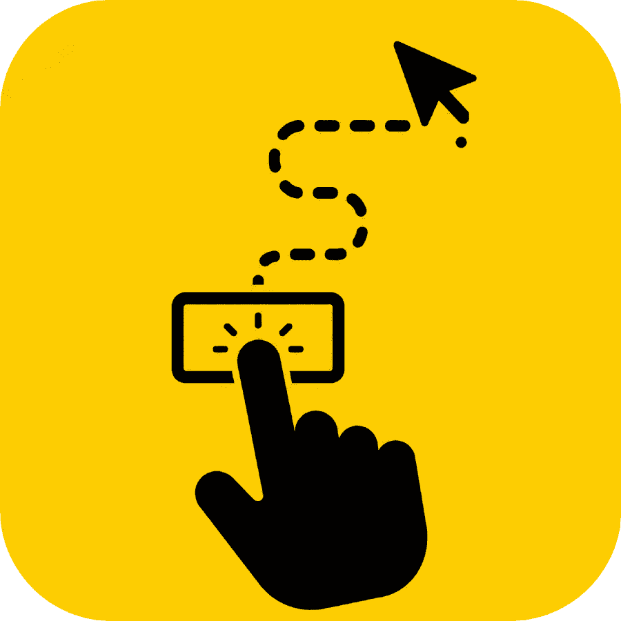
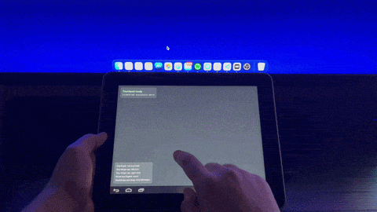
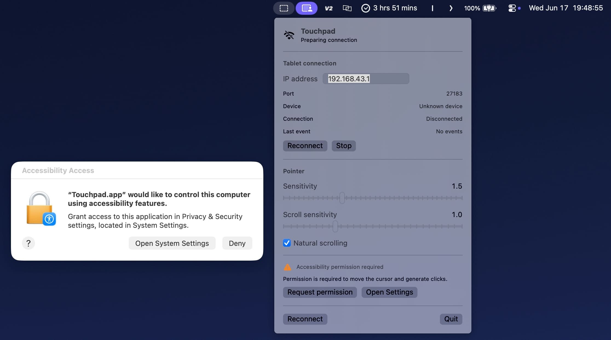
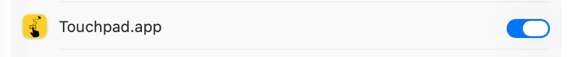
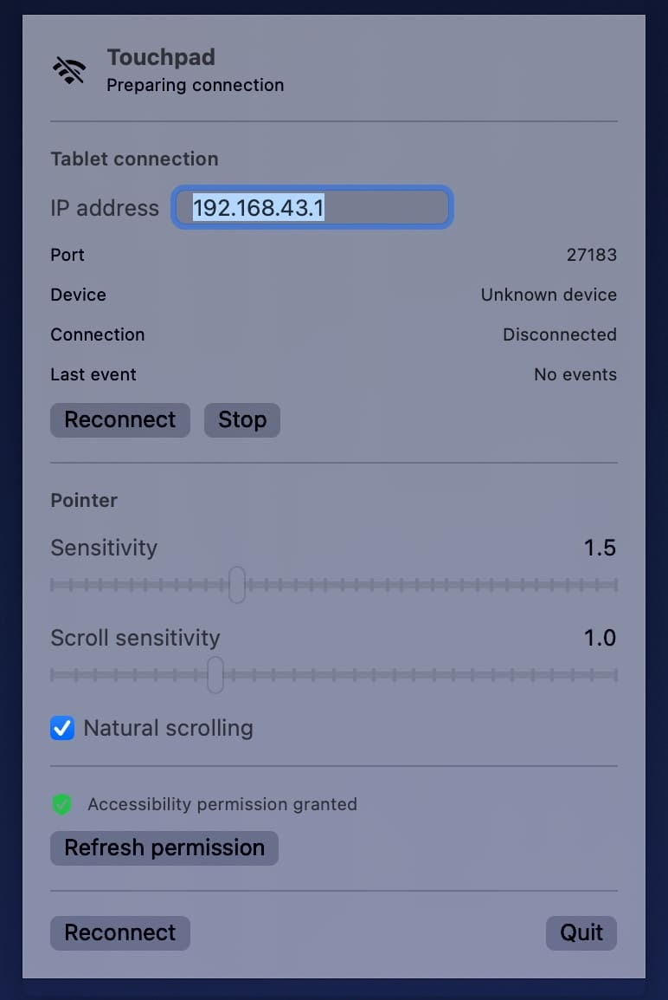
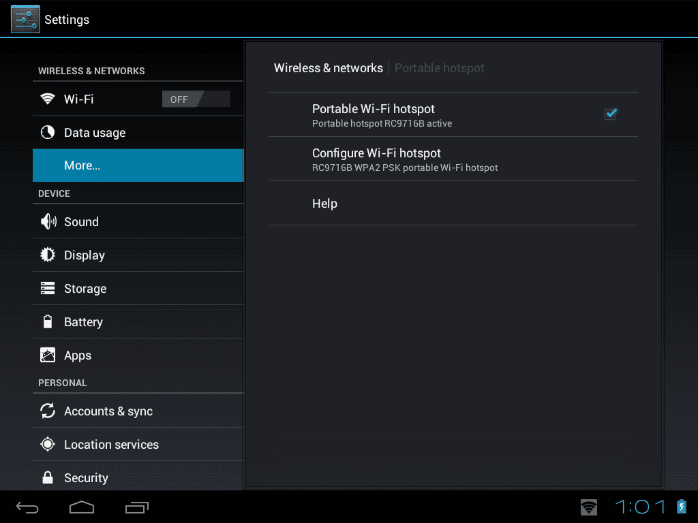
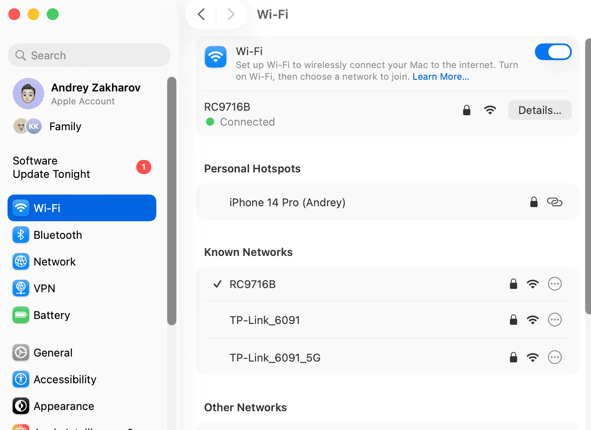
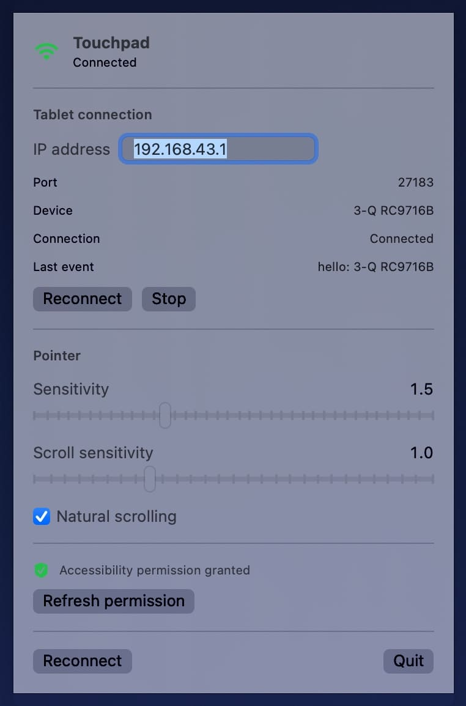
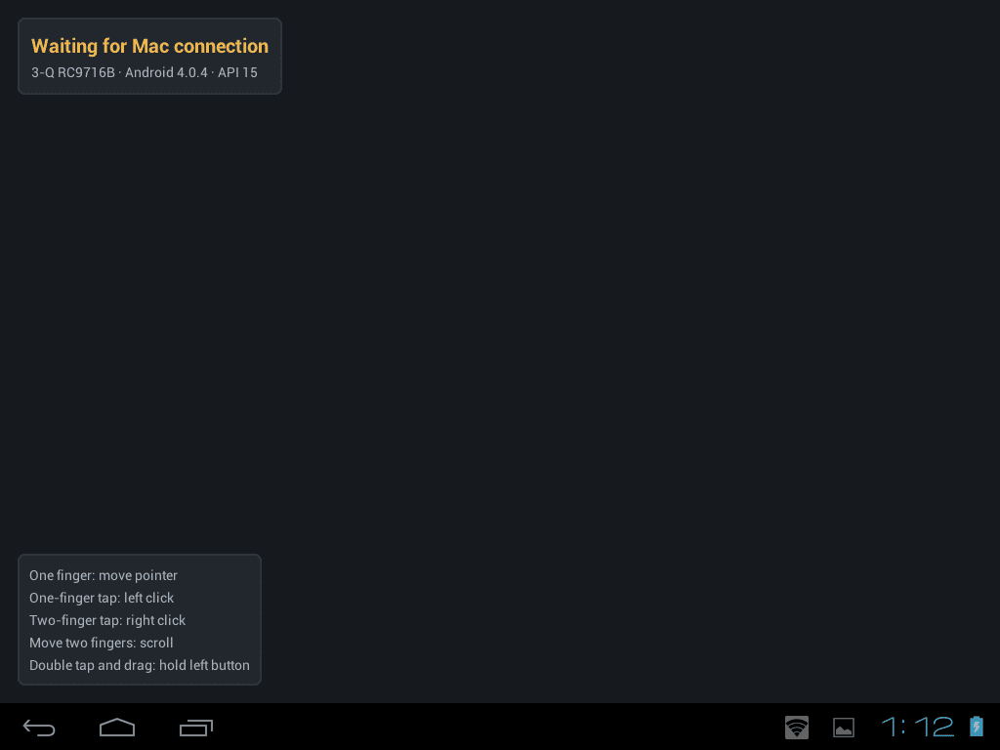
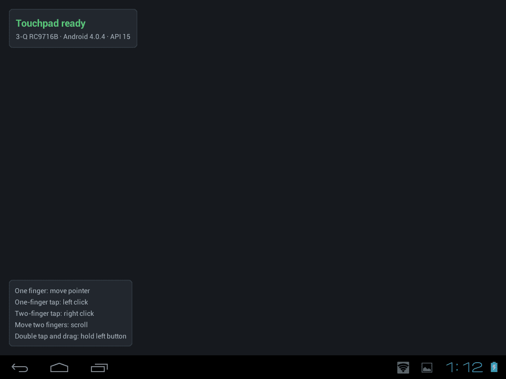

# Touchpad

Touchpad превращает старый Android-планшет в беспроводной тачпад для macOS.

Проект состоит из двух приложений:

- Android-приложение считывает касания и распознаёт жесты на экране планшета;
- macOS-приложение получает события по локальной сети и управляет курсором, кликами, прокруткой и перетаскиванием.

Интернет для работы не нужен.

### Демонстрация работы

## Как это работает

Планшет создаёт точку доступа Wi-Fi.

Mac подключается к этой сети и устанавливает прямое TCP-соединение с Android-приложением.

Android-приложение запускает локальный сервер на порту `27183` и отправляет события касаний в формате JSON.

macOS-приложение принимает эти события и преобразует их в системные события мыши через Core Graphics.

Схема работы:

    Касания на планшете
            ↓
    Android-приложение
            ↓
    TCP-сервер в локальной сети
            ↓
    macOS-приложение
            ↓
    Движение курсора, клики, прокрутка и перетаскивание

ADB не используется во время обычной работы. Он нужен только разработчику для установки и отладки Android-приложения.

## Возможности

### Android-приложение

- движение курсора одним пальцем;
- левый клик одним коротким тапом;
- правый клик тапом двумя пальцами;
- прокрутка движением двумя пальцами;
- удержание левой кнопки двойным тапом с последующим движением;
- автоматический поворот экрана;
- отображение состояния подключения;
- отображение подсказок по жестам;
- совместимость с Android 4.0.4;
- собственная иконка приложения.

### macOS-приложение

- работа из строки меню;
- прямое подключение к планшету по локальной сети;
- настройка IP-адреса планшета;
- автоматическое переподключение;
- настройка чувствительности курсора;
- настройка чувствительности прокрутки;
- переключатель естественной прокрутки;
- отображение состояния соединения и имени устройства;
- управление курсором через системные события macOS;
- собственная иконка приложения.

## Жесты

    Движение одним пальцем       → движение курсора
    Один короткий тап            → левый клик
    Тап двумя пальцами           → правый клик
    Движение двумя пальцами      → прокрутка
    Двойной тап и движение       → удержание левой кнопки и перетаскивание

## Установка

Скачайте файлы из последнего GitHub Release:

- `Touchpad-Android-<version>.apk`;
- `Touchpad-macOS-<version>.zip`.

### Android

1. Разрешите установку приложений из неизвестных источников.
2. Установите APK на планшет.
3. Откройте приложение Touchpad.
4. Оставьте приложение открытым во время работы.

Приложение рассчитано на Android 4.0.4 и более новые совместимые версии Android.

### macOS

1. Распакуйте архив.
2. Переместите `Touchpad.app` в папку `Applications`.
3. Запустите приложение.
4. При первом запуске macOS может показать предупреждение для неподписанного приложения. В таком случае нажмите по приложению правой кнопкой и выберите `Открыть`.

## Первоначальная настройка

### 1. Предоставление разрешения в macOS

При первом запуске Touchpad сообщит, что приложению требуется разрешение для управления курсором.

Нажмите кнопку перехода в системные настройки.

Откроется раздел:

    Системные настройки
    → Конфиденциальность и безопасность
    → Универсальный доступ

Включите переключатель напротив приложения Touchpad. macOS может попросить ввести пароль пользователя или подтвердить действие с помощью Touch ID.

Вернитесь в Touchpad и нажмите `Request Permission`, чтобы приложение повторно проверило разрешение.

Если рядом с сообщением о доступе отображается зелёный значок, настройка выполнена успешно.

### 2. Настройка точки доступа на планшете

Откройте настройки Android и перейдите в раздел:

    Настройки
    → Беспроводные сети
    → Переносная точка доступа

Установите флажок напротив пункта `Переносная точка доступа`.

В разделе настройки точки доступа можно изменить:

- имя сети;
- пароль;
- тип безопасности.

Для безопасности рекомендуется использовать защищённую паролем сеть.

### 3. Подключение Mac к сети планшета

Откройте меню Wi-Fi на Mac и подключитесь к сети, созданной планшетом.

Интернет в этой сети может отсутствовать. Это нормально: Touchpad использует только локальное соединение между планшетом и Mac.

### 4. Подключение приложений

Откройте Touchpad на планшете и Touchpad на Mac.

В macOS-приложении должен быть указан локальный IP-адрес планшета. Адрес зависит от прошивки и настроек точки доступа. Обычно это адрес локального шлюза сети, созданной планшетом.

Порт соединения:

    27183

Если соединение не установилось автоматически, нажмите `Reconnect`.

После успешного подключения macOS-приложение покажет статус `Connected`.

Android-приложение также показывает текущее состояние соединения.

До подключения Mac:

После подключения Mac:

После появления статуса подключения планшет можно использовать как тачпад.

## Повторный запуск

После первоначальной настройки обычно достаточно:

1. включить точку доступа на планшете;
2. подключить Mac к сети планшета;
3. открыть Touchpad на планшете;
4. открыть Touchpad на Mac;
5. дождаться статуса `Connected`.

Интернет для работы не требуется. Оба устройства должны находиться в одной локальной сети.

## Состав проекта

    Touchpad/
    ├── android-app/
    │   └── Android-приложение и TCP-сервер
    ├── macos-app/
    │   └── macOS-клиент и контроллер курсора
    ├── assets/
    │   ├── исходные изображения иконок
    │   └── изображения для документации
    ├── protocol/
    │   └── описание протокола обмена
    ├── docs/
    │   └── документация проекта
    ├── scripts/
    │   └── скрипты сборки, запуска и создания релизов
    └── .vscode/
        └── настройки Visual Studio Code

## Сборка из исходного кода

### Android

    cd android-app
    ./gradlew clean assembleDebug

Готовый APK:

    android-app/app/build/outputs/apk/debug/app-debug.apk

### macOS

    cd macos-app
    swift build --product Touchpad
    swift test
    swift run Touchpad

Также можно использовать скрипт из корня репозитория:

    ./scripts/run-macos.sh

## Среда разработки и тестирования

- MacBook Air M2 — macOS Tahoe 26.5.
- Планшет 3Q Surf RC9716B-DG — Android 4.0.4, процессор 1 ГГц.
